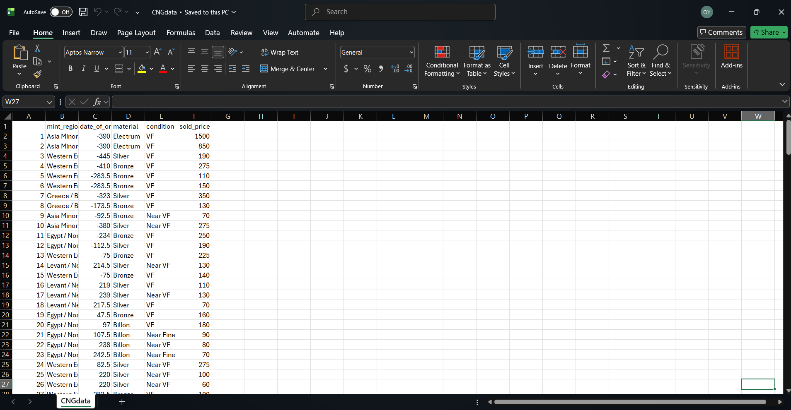

```{r}
#| echo: false
#| message: false
library(DT)
library(plotly)
```

```{r}
#| echo: false
auctiondata <- read.csv("CNGdata.csv")
```

In the modern day ancient coins are a commodity and a collector's item, despite or perhaps enhanced by their value as historical artifacts. As such, the prices of ancient coins are some of their most interesting features — what monetary value a theoretically 'worthless' coin has in the modern day can be effectively attributed to what somebody is willing to pay for it.

## Building a Dataset from Auction Data

As part of my analysis of all things eagle-coin related, I took data from the *Classical Numismatic Group LLC.*'s online research database of historic auctions in order to analyze some recent price data. All of the auction data was manually entered into an excel spreadsheet by me, in the format seen below, and converted into a .csv file. I selected 200 coins all minted before 300 AD (with one exception) and sold after 2020, and then logged the relevant data from their entries— This included sold price, material, condition, minting location, and date of creation. Because of lack of quantity of coins from specific mints, I generalized the mints into larger regions.



And here, you can explore the auction data dataset yourself:

```{r}
datatable(auctiondata)
```

The variables I chose to add are the most important variables in deciding a coin's value, and most often it's the combination of multiple rare traits that makes a coin uniquely valuable— for instance, coins minted under Cleopatra VII are incredibly expensive, but if they are in poor condition they tend to be cheaper. Likewise a common bronze coin might be graded Extremely Fine, and ergo be worth more than a coin that might typically be rarer.

## Initial Findings and Visualizations

Before building the price predictor I want to first show some interesting visuals I developed from the dataset, which will help provide context for whence the predictor was derived.

The first visual is a bar chart with the number of coins that were sold at different price points— looking at it you can clearly see a right-skew, with most of the coins being sold at around \$100-\$200. There were however a few exceptional coins with much higher prices, although fewer and fewer as the price grew.

```{r}
hist(auctiondata$sold_price[auctiondata$sold_price > 1], main = "Frequency of Coin Auction Final Prices", xlab = "Sold Price", breaks = 20, col = "brown", border = "white")
```

The vast majority of the coins were graded Fine, Near Very Fine, and Very Fine, leaving only a bit of room for coins at other condition levels. As a result, in this boxplot the trend is the strongest in the lowest grades, but you can still see how the price generally increases as the condition goes up. The boxes that appear only as lines are representative of the limited number of entries with those grade levels. Note also the range of sold prices for Near VF and VF in particular.

```{r}
#| echo: false
ana_order <- c("Near Fine", "Fine", "Near VF", "VF", "Near XF", "XF", "Choice XF", "AU")
auctiondata$condition = factor(auctiondata$condition, levels = ana_order)
```

```{r}

boxplot(sold_price~condition, data=auctiondata, main = "Price Variance Based on Condition", xlab = "Condition, Increasing Left to Right", ylab = "Sold Price")
```

Here are two visualizations of how many coins in the dataset there are for each condition level, to put the previous plot even more into context:

```{r}
condition_data <- table(unlist(auctiondata$condition))

barplot(condition_data, main = "Number of Datapoints Per Condition", xlab = "Condition, Increasing Right to Left", ylab = "Number of Occurences", col = "brown")
```

```{r}
#| echo: false
sorted_cond_data = sort(condition_data, decreasing = TRUE)
simplified_cond_data = c(sorted_cond_data[0:4], "Other" = sum(sorted_cond_data[5:8]))
```

```{r}
pie(simplified_cond_data)
```

Lastly, here's a histogram showing how coins in the dataset were minted over time. The y axis measures the number of occurrences of dates within the timeframes noted on the x axis, and the colored sections of the chart indicate what portion of coins from a given era came from each region.

The distribution is somewhat bimodal, or even potentially trimodal with the highest points being between 300 and 200 BC (mostly from Alexandria/the Ptolemaic Empire) and between 200 and 300 AD.

Ignoring the single post-300 AD coin, there's a weak, but present positive linear relationship between chronology and quantity of eagles. Although this is also based on the auction dataset, it is generally representative of the same trend we can see in larger datasets.

```{r}
fig = plot_ly(auctiondata, x = ~date_of_origin, color = ~mint_region, type = 'histogram') %>%
  layout(barmode = 'stack')
fig
```

## Price Prediction Regression Model

The major project I've been able to create by collecting this auction dataset is a regression model that predicts the value of an ancient coin based on the variables in the dataset. This model, created through multiple linear regression, predicts a coin's value based on what values have been inputted for each variable.

For example, based on the model a coin minted in BLAH BLAH BLAH TO BE WRITTEN

It's important to note that while there is almost certainly strong correlation between many of these variables and price, because of the limited number of datapoints in the dataset and the fact that many of the variables are categorical, a completely accurate linear prediction model is not reasonably possible. However, the model was created in the same way a larger (or more numerical) dataset would be developed.

```{r}
#| echo: false
price_model <- lm(sold_price ~ mint_region + date_of_origin + material + condition, data = auctiondata)
```

```{r}
#| echo: false
price_model_modded <- lm(log(sold_price) ~ mint_region + date_of_origin + material + condition, data = auctiondata)
```

Take a look at this: The plot of residuals against the fitted linear model.

```{r}
plot(price_model, which = 1, sub = "", col = "brown")
```

Some explanation of the image before I interpret it: Right now, the model maps the difference between actual price data from the dataset and the price predicted by the model on the Y-axis as points, while the x-axis represents the prices of the coins.

The predicted model is very clearly nonlinear here, making a sort of U shape. The shaping of the model indicates that a linear model is not a good predictor for this dataset. Normally this is a bad sign, but take a look at where the majority of the data is:

The U shape is effectively divided into three sections— an initial decreasing section, a flat middle section, and an increasing third section. In the case of our data, the vast majority of the residuals are strongly correlated with the slightly negative linear trend in the first third of the model.

Additionally, look at the shape the residuals make over time: The residuals start closely tied to the model, and spread out over time in a shape almost like a cone or megaphone. This is a phenomenon known as heteroscedasticity, and its presence here indicates that when predicting coins with at low price points the model is highly accurate— however, as price predictions get high the model's accuracy decreases drastically.

It's also important to note that this model is limited by the fact that coin prices cannot drop below \$0.

Here's another visual, which fixes our spread issue and makes the model a bit more linear:

```{r}
plot(price_model_modded, which = 1, sub = "", col = "brown")
```

By taking the log() of the sold_price category in the original model, we can approximate a somewhat more linear and significantly more evenly distributed regression model. This does change the meaning of the plot, though, and its distribution still isn't incredibly even.

The y-axis represent percentage errors between the predicted prices and actual prices. This means that a point at 0.1 on the y-axis had a price 10% higher than what the model predicted.

The x-axis is a little bit more complicated, but it can be effectively understood as a squished or shrunken down version of the previous x-axis. Each of the numbers on the x-axis, when used as the exponent on e\^x to undo the log function, will be equivalent to some dollar value. Basically, a coin at 6 is more expensive than a coin at 5 by a lot, and a coin at 5 is more expensive than a coin at 4 by a smaller margin, and so on and so forth.

Onto a Q-Q plot, which we'll do for both the original and log/modified linear data. First the original:

```{r}
plot(price_model, which = 2, sub = "", col = "brown")
```

And the log data:

```{r}
plot(price_model_modded, which = 2, sub = "", col = "brown")
```

In both graphs we can see some variance from the theoretical line on the tail ends, particularly at the higher end of the range. This is generally expected since the data, as we saw above, is strongly right skewed. This effect is slightly reduced in the Q-Q for our log model, although it is certainly still present.

Overall, this model is relatively effective at predicting low price coins, but fails when estimating for coins of higher prices. This comes directly as a result of the fact that the data is significantly right skewed, and with more data regarding higher value coin sales the issue could certainly be resolved.

Although price prediction for coins is achievable, many of the sold coins listed on even *CNG*'s website were sold for values much higher than the group's own prediction model, illustrating the difficulty in developing price predictions for a market where new, unique artifacts are introduced constantly.

## Test the Model


```{ojs}
//| echo: false
data = FileAttachment("CNGdata.csv").csv({ typed: true })
```

```{ojs}
//| echo: false
viewof minting_date = Inputs.range(
  [-1000, 350], 
  {value: 0, step: 10, label: "Minting Date"}
)

viewof material = Inputs.select(
  ["Bronze", "Silver", "Electrum", "Potin", "Billon"], 
  { value: ["Bronze", "Silver", "Electrum", "Potin", "Billon"], 
    label: "Material:"
  }
)

viewof region = Inputs.select(
  ["Egypt / North Africa", "Greece / Balkans", "Levant / Near East", "Steppe / Black Sea", "Western Europe", "Asia Minor"], 
  { value: ["Egypt / North Africa", "Greece / Balkans", "Levant / Near East", "Steppe / Black Sea", "Western Europe", "Asia Minor"], 
    label: "Region:"
  }
)

viewof condition = Inputs.select(
  ["Fine", "Near VF", "VF", "Near XF", "XF", "Choice XF", "AU"], 
  { value: ["Fine", "Near VF", "VF", "Near XF", "XF", "Choice XF", "AU"], 
    label: "Condition:"
  }
)
```

```{ojs}
//| echo: false
//sold_price ~ mint_region + date_of_origin + material + condition
region_coeff = {
  if (region === "Egypt / North Africa") return 131.5978;
  if (region === "Greece / Balkans") return 127.1328;
  if (region === "Levant / Near East") return 157.1758;
  if (region === "Steppe / Black Sea") return 1548.7301;
  if (region === "Western Europe") return 175.2700;
  if (region === "Asia Minor") return 0;
  return 0; // Baseline
}
  
material_coeff = {
  if (material === "Bronze") return 41.5806;
  if (material === "Electrum") return 1136.6315;
  if (material === "Potin") return -91.0923;
  if (material === "Silver") return 251.8883;
  if (material === "Billon") return 0;
  return 0; // BL
}

condition_coeff = {
  if (condition === "Fine") return -139.4210;
  if (condition === "Near VF") return -70.9976;
  if (condition === "VF") return -175.7941;
  if (condition === "Near XF") return 8.5978;
  if (condition === "XF") return 374.1220;
  if (condition === "Choice XF") return 82.5739;
  if (condition === "AU") return -132.7143;
  return 0; //BL

}

date_coeff = -0.2103
```

```{ojs}
//| echo: false
//sold_price ~ mint_region + date_of_origin + material + condition
predicted_price = 132.1588 + region_coeff + material_coeff + condition_coeff + (date_coeff * minting_date)

```

```{ojs}
//| echo: false

// 1. Generate an array of dates from -1000 to 350 (stepping by 10 years)
all_dates = d3.range(-1000, 360, 10)

// 2. Map those dates to their predicted prices based on the CURRENT user selections
regression_line_data = all_dates.map(d => {
  let base_price = 132.1588 + region_coeff + material_coeff + condition_coeff + (date_coeff * d);
  return {
    date: d,
    price: Math.max(0, base_price) // Ensure it doesn't drop below $0 on the chart
  };
})
```

-- -- -- -- -- -- -- --

```{ojs}
//| echo: false


Plot.plot({
  grid: true,
  style: {color: "#000000", fontSize: "15px"
  },
  caption: "The blue line shows how the price of a coin with your qualities changes as its minting date increases. The red dot indicates the estimated price point for your inputted date.",
  x: {
    label: "",
    tickFormat: d => d < 0 ? `${Math.abs(d)} BC` : d === 0 ? "1 AD" : `${d} AD`
  },
  y: {
    label: "Predicted Price ($ USD)",
    zero: true
  },
  marks: [
    // Draw the continuous regression line for the selected attributes
    Plot.line(regression_line_data, {
      x: "date", 
      y: "price", 
      stroke: "#2b5c8f", 
      strokeWidth: 3
    }),
    
    Plot.dot([{ date: minting_date, price: predicted_price }], {
      x: "date", 
      y: "price", 
      fill: "#e05a47", 
      r: 7,
      stroke: "white",
      strokeWidth: 2,
      channels: {
        Price: "price",
        Date: "date"
      },
      tip: {
        format: {
          x: false, y: false,
          Price: d => `$${d.toFixed(2)}`,
          Date: d => d < 0 ? `${Math.abs(d)} BC` : `${d} AD`
        }
      }
    })
  ]
})
```

